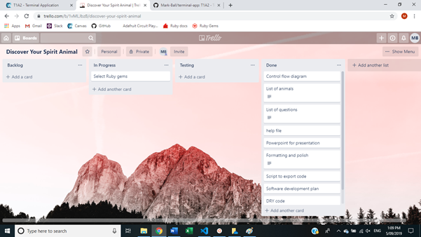

#Software development plan for Discover Your Spirit Animal

https://github.com/Mark-Ball/terminal-app

##Statement of Purpose and Scope

Discover Your Spirit Animal is an application which runs in the terminal and assesses the user's personality type by asking the user questions and then informing the user which animal they are similar to and which personality attributes they share with the animal.

The problem this application will solve is to provide personality information to people who are too time-poor to complete academic personality testing such as the Myers-Briggs Type Indicator, which can involve 100-200 questions and take over 30 minutes to complete. Discover Your Spirit Animal also offers a fun alternative to these other personality assessments, which may seem disinteresting to some. The reason for the development of Discover Your Spirit Animal is to allow users to learn more about themselves.

The target audience for Discover Your Spirit Animal is people who enjoy taking online quizzes to learn more about their personality but are too time-poor to complete longer personality assessments. Secondly, the application is also for people who are disinterested in participating in an academic personality assessment and prefer a fun alternative. Lastly, the application is for people who do not wish to pay for their personality assessment. The target audience will prefer Discover Your Spirit Animal to other personality assessments available online due to the speed with which they can complete the quiz, the fun questions, and because it is free to take.

The application will function by presenting the user with a scenario and asking what they would do. Available options will be displayed and the user will be asked to input their choice into the terminal. After inputting their choice to the scenario, the next scenario will be presented. This process will repeat until all questions have been asked and the program will then output to the screen the user's spirit animal, as well as a paragraph explaining their personality characteristics.

##Features
This section will describe three features of the application.

###Feature 1 - List of animals
Discover Your Spirit Animal includes four animals with distinct personalities which may be the final result of the quiz. These animals were chosen based on their behaviour and personality. Each animal also has a short paragraph describing the most prominent personality characteristics of the animal.

The animals are held in the program as a local array variable, where each element of the array is a hash. Each hash contains two symbols as keys: the name of the animal and a description. The values that are paired with each key are strings. This allows the application to iterate through the hashes within the array looking for the value of the name key, and retrieve the description which is paired with each name. Therefore the correct description is always presented to the user.

###Feature 2 - List of questions
Discover Your Spirit Animal includes several questions which are printed to the screen. These questions describe a scenario and ask the user which of the defined responses they wish to choose. The responses the user gives to these questions determines their spirit animal.

Following each question, the application pauses to receive the user's response and then saves that response under a local variable. Each question exists within a loop, which checks if the response was valid. E.g. if the question required the response to be 1 or 2, anything else will print a short error message to the screen and display the same question again. Therefore all questions will be answered with valid responses.

###Feature 3 - Help option
Discover Your Spirit Animal includes a help option which may assist users in using the application. This information includes general background on the application such as its purpose, and instructions on how to interact with the application.

The help option is accessed by typing the following in the terminal:

    ruby discover_your_spirit_animal.rb -help

An if statement is included in discover_your_spirit_animal.rb which queries if ARGV equals "-help" and if so prints the help message to the screen. The application is then terminated, meaning that if the user wishes to use the application, they must call it again without the -help argument.

##User interaction and experience
User interaction is a simple but important element of Discover Your Spirit Animal.

Upon calling the application, users have the option to display the help menu by passing "-help" as an argument when calling the application, as follows:

    ruby discover_your_spirit_animal.rb -help

This displays a help message to the screen. The help message explains a general overview of the application, the flow of questions and responses, the error handling, and what the user needs to do at each point to progress through the application. The application terminates after displaying this message, so it must be called again without the -help option to progress as normal.

Once the application is run normally (i.e. without the help option), the first thing the user sees is a welcome message. This message contains a 1-sentence description of the purpose of Discover Your Spirit Animal and short instructions of how to progress through the application.

>Welcome to Discover Your Spirit Animal. This application will help you discover what animal spirit lies within
>
>When presented with a list of choices, please type the number corresponding to the choice and press enter.

The user is immediately presented with the first question. This involves a block of text describing a situation followed by the question "What do you do?". For ease of use, the available options are printed to the screen along with the description of the scenario. This informs users of what they need to enter into the terminal to progress through the application. The user must select from a list of 2-3 available options. The first question is presented below:

>You and your friend are at the bar. Your friend accidentally spills his drink on a group of large drunk men. They demand an apology but your friend refuses. An argument begins. He squares up as if to fight them all, then looks to you. What do you do?
>
>Options:
>1. Stand with your friend no matter what
>2. Convince your friend to back down
>3. What friend? I don't even know this guy!

Despite efforts to inform the user of available options, users are free to type any string of characters into the terminal in response to the questions. The possibility of users entering invalid responses will be handled by an if/else statement where the if and elsif statements handle valid input. The only valid inputs are numbers corresponding to the choice desired, with all other inputs including strings, integers other than those corresponding to choices, and nil considered invalid entries. Invalid entries are handled by the else portion of the if/else statement. When this happens a message will be displayed to the user explaining that their input was not valid and reminding them that they need to enter a number corresponding to a choice to continue, then the previous question will be presented again.

An example of the error message is presented below.

>"5" was not a valid input. Please input a number corresponding to your choice.

If a valid response is entered, the response is saved and the next question is presented to the user. This loop continues until valid responses have been provided to all questions. When valid responses have been provided to all questions, the application presents their spirit animal to the user.

An example of the result shown to the user is presented below.

>"You are the Leopard, an agile hunter of the cat family, who prefers to hunt alone. You are determined in going after the things you want, no matter the opinion of others."

This is the end of the application.

##Control flow diagram

A version of the control flow diagram can be found in the 'documentation' directory, which is in the source directory of the project. It is also available on Github.

##Implementation plan

| Feature | Checklist | Priority | Deadline |
|---------|-----------|----------|----------|
|1. list of animals|1. Compose list of animals 2. Compose list of animal descriptions 3. Create array of hashes with names as keys and descriptions as values 4. Put array in separate file, accessible by method 5. Call method using require_relative in index file | High | 04/09/2019 |
|2. list of questions|1. Compose list of questions 2. Create array of questions 3. Put array in separate file, accessible by method 4. Call array using require_relative in index file 5. Display question to user|High|04/09/2019|
|3. Help feature|1. Compose help message 2. Create a variable which copies ARGV 3. Implement if statement which detects if the ARGV copy includes the string "-help" 4. Display the help message if required 5. Test option with both valid and invalid input|Medium|05/09/2019|

Progression through the checklist was tracked using Trello. Status screenshots of the project at various points are presented below.

Day 1 beginning

Day 1 end

Day 2 noon

Day 2 end

Day 3 noon

Day 3 end

##Development log

Day 2, 04/09/2019

The goals for today were:
1. Complete all basic features listed on the software development plan, complete manual testing of these features, and correct any errors.

This was completed and manual testing uncovered multiple bugs, which were subsequently corrected. The current iteration of the application has passed all manual tests.

2. Complete the User experience section of the software development plan. This section had not been completed prior to this point because a prototype of the application was required to describe what the user would see on the screen when they use the application.

No blockers for these goals were anticipated.

Day 3, 05/09/2019

Yesterday's goal, which was to complete all basic features of the application and the User experience section of this document, was completed successfully.

The goals for today were:
1. Find, import, and use 4 Ruby gems.

2. Polish the code (e.g. styling conventions, DRY).

3. Write a script to move all necessary files to dist directory.

The only blocker anticipated for this was difficulty in implementing gems due to lacking documentation.

##Help
Discover Your Spirit Animal is written in Ruby, and therefore requires Ruby to be installed on the computer.

A file called "create_dist" is included in the repository, which creates a directory called "dist" and copies the two files necessary to run the application:

- discover_your_spirit_animal.rb
- spirit_animal_methods.rb

The application can then be run by navigating into the "dist" directory and calling the discover_your_spirit_animal.rb program using the following input:

    ruby discover_your_spirit_animal.rb

Alternatively, information explaining how to use the application can be displayed to the screen by typing the following into the terminal while in the "dist" directory:

    ruby discover_your_spirit_animal.rb -help

The application utilises three gems, which are described in the following section.

#Gems

The following Ruby gems are required to run the application:
- colorize (https://rubygems.org/gems/colorize)
- artii (https://rubygems.org/gems/artii)
- crayon (https://rubygems.org/gems/crayon)

These gems can be installed by entering the following code in the terminal:

    gem install colorize
    gem install artii
    gem install crayon

Additional testing was performed using the gem Rubocop, which checks files for stylistic conventions. A screenshot of Rubocop output is presented below.

##Testing
All main features of the application were subject to manual testing. Features of the application were tested by running the application and inputting a series of inputs. When these inputs were valid it was expected that the program would continue. When inputs were invalid it was expected that the program would display a message informing the user that the input was not valid, and present the question again.

The test cases and results are included in the attached spreadsheet: https://github.com/Mark-Ball/terminal-app/blob/master/documentation/Spirit%20Animal%20testing.xlsx
